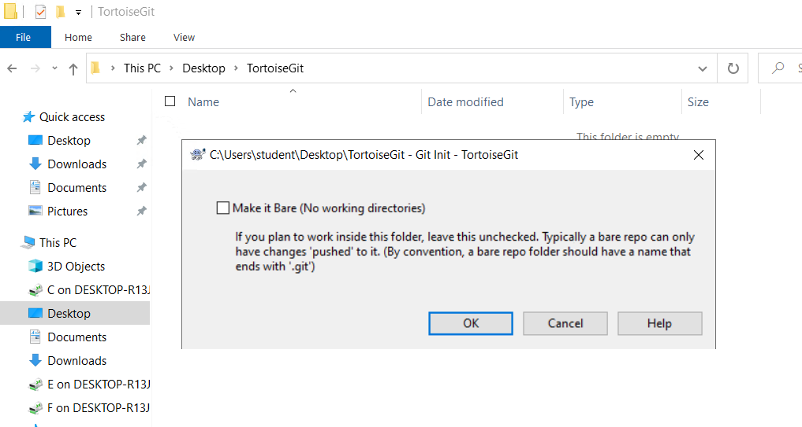
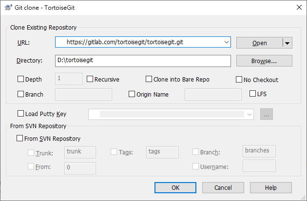
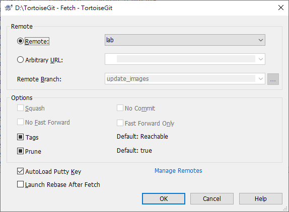
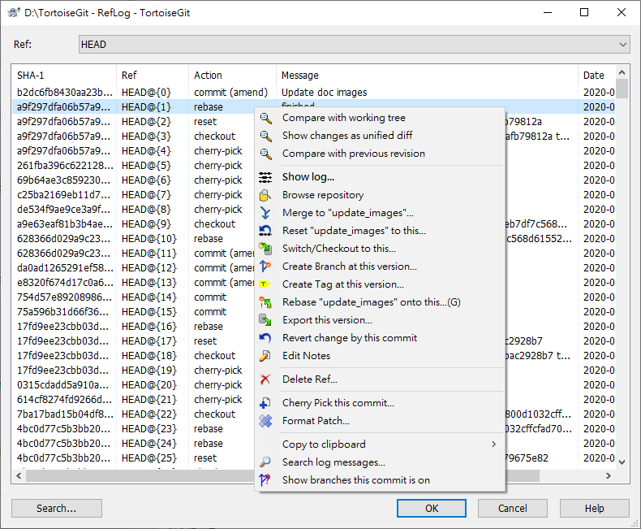
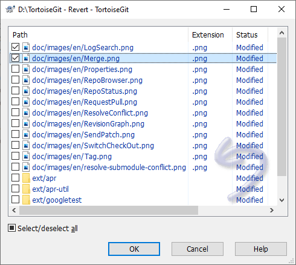

### Create Repository

Creating an empty git repository is very simple. 

1. Create new directory `TortoiseGit` on the Desktop.
2. In the `TortoiseGit` directory, just use the explorer context menu and select `Git Create Repository here`.

You can choose here between a bare and normal git repository. A normal repository has a working tree attached to which files can be checkout out and committed whereas a bare repository only can be pushed to and pulled from. After a (non bare) repository is created a message box will be shown:

**Note:** Make sure to delete `.git` directory before starting new task.

### Clone Repository

This section talks about how to clone a git repository from an existing repository. This operation is used to get a full copy of a remote repository. Cloning a git repository is very simple. At an empty directory, just use the explorer context menu and select `Git Clone ...` 

`https://github.com/TortoiseGit/TortoiseGit.git`

The Clone Dialog will show.

`URL`: Input repository URL address, which you will clone from. You can click **Browse** to browse directory.

`Directory`: Input your local directory, which you will clone to. You can click **Browse** to browse directory.

`Clone` will checkout current HEAD to work space automatically.

Click **OK** to start cloning the repo.

### Checking Out A Working Tree (Switch to commit)

The Switch/Checkout dialog can be used to checkout a specific version to the working tree (i.e., all files are updated to match their state of the selected version). Normally, a specific version will be represented by a (local) branch which is set as the current branch.

Select a git repository directory : `Desktop\TortoiseGit\TortoiseGit` in windows explorer. Right click to pop up the context menu and select the command `TortoiseGit` → `Switch/Checkout...`, which brings up the following dialog box:

If you enter a branch name at **Create New Branch**, a new branch will be created. Also, the new branch will be set as the current branch (HEAD).

You can click on the `...` to browse the references/branches/log to choose a branch to checkout.

When you selected a remote branch, you can check Track in order to track the remote branch. When you open the push, pull or sync dialog, the remote branch will be pre-selected automatically.

### Committing Your Changes To The Repository

Storing the changes you made to your working tree is known as committing the changes. you can use TortoiseGit → Check for Modifications first, to see which files have changed locally.

**Task:** Make any change in `README.md` in the notepad++ editor and save the changes.

**The Commit Dialog**

If there are no conflicts, you are ready to commit your changes. Select any file and/or folders you want to commit, then `TortoiseGit` → `Commit....`

The commit dialog will show you every changed file, including added, deleted and unversioned files. If you don't want a changed file to be committed, just uncheck that file. If you want to include an unversioned file, just check that file to add it to the commit.

**Double clicking** on any modified file in the commit dialog will launch the external diff tool to show your changes. The context menu will give you more options, as shown in the screenshot. You can also drag files from here into another application such as a text editor or an IDE.

#### Commit Log Messages

You can apply simple formatting to your log messages using a convention similar to that used within emails. To apply styling to text, use *text* for bold, _text_ for underlining, and ^text^ for italics.

**Commit Progress**

After pressing `Commit`, a dialog appears displaying the progress of the commit.

### Pull and Fetch change

In this task, we will look how to fetch or pull (i.e., download) changes from another repository. The difference between pull and fetch is:

Fetch just downloads the objects and refs from a remote repository and normally updates the remote tracking branches. Pull, however, will not only download the changes, but also merges them - it is the combination of fetch and merge (cf. the section called “Merging”). The configured remote tracking branch is selected automatically.

A pull/fetch can be initiated by using `TortoiseGit` → `Pull...` or `TortoiseGit` → `Fetch....` Fetching and pulling changes is also possible using the Sync dialog (cf. the section called “Sync”), however, there you have less options, but the sync dialog allows you to initiate other operations such as pushing and to see diffs and changes.

The fetch and pull dialog will open.

**Sync**

The Sync Dialog provides an interface for all operations related with remote repositories in one dialog. This includes push, pull, fetch, remote update, submodule update, send patch... However, the sync dialog provides less options as the regarding dialogs.

The sync dialog can be opened using `Sync...`.

**Activity: Push Changes in GitHub**

1. Create a new repository on GitHub.
2. Clone the repository using **TortoiseGit**.
3. Make some changes in the repo and commit the changes.
4. In order to perform a push open the push dialog using `TortoiseGit` → `Push...`.

**Note:** You will have to login using `TortoiseGit` from GitHub first. Click `Sign in with your browser` and login.

**Browse All Refs**

This section talks about the reference browser, which allows you to view and work with all refs (tags, branches, remote branches, stash and so on). It can be opened using TortoiseGit → Browse Reference....

**Log Dialog**

For every change you make and commit, you should provide a log message for that change. That way you can later find out what changes you made and why, and you have a detailed log for your development process.

The Log Dialog retrieves all those log messages and shows them to you. 

Invoking the Revision Log Dialog

There are several places from where you can show the Log dialog:

- From the explorer context menu using `TortoiseGit` → `Show log....`
- From various TortoiseGit dialogs where you can select a commit (oftentimes using a ... button).
- From various TortoiseGit dialogs where commit entries or files are shown using the context menu.

**Revision Log Actions**

The top pane has an Actions column containing icons that summarize what has been done in that revision. There are four different icons, each shown in its own column.

**Revision Graphs**

Sometimes you need to know where branches and tags were taken from the point, and the ideal way to view this sort of information is as a graph or tree structure. That's when you need to use `TortoiseGit` → `Revision Graph...`

This command analyses the revision history and attempts to create a direct graph showing the points at tag, branch and other reference.

**Important**

In order to generate the graph, TortoiseGit must fetch all log messages from the repository root. Just show commits which have some reference point to.

**Using the Graph**

To make it easier to navigate a large graph, use the overview window. This shows the entire graph in a small window, with the currently displayed portion highlighted. You can drag the highlighted area to change the displayed region.

The revision date, author and comments are shown in a hint box whenever the mouse hovers over a revision box.

If you select two revisions (Use **Ctrl-left click**), you can use the context menu to show the differences between these revisions. You can choose to show differences as at the branch creation points, but usually you will want to show the differences at the branch end points, i.e. at the HEAD revision.

You can view the differences as a Unified-Diff file, which shows all differences in a single file with minimal context. If you opt to `Context Menu` → `Compare Revisions` you will be presented with a list of changed files. Double click on a file name to fetch both revisions of the file and compare them using the visual difference tool.

If you right click on a revision you can use `Context Menu` → `Show Log` to view the history.

**Refreshing the View**

If you want to check the server again for newer information, you can simply refresh the view using F5.

### Reference Log

The reference log (RefLog) displays the history of a reference (i.e., it is displayed to which commits it pointed in the past). In can be opened using `TortoiseGit` → `RefLog`, however, you have to hold the Shift key while right clicking on on a folder in the explorer in order to see this, because it is in the extended context menu by default.

The RefLog can be used to restore deleted commits or HEAD positions (e.g. when you deleted a branch which was HEAD some time ago).

### The Repository Browser

Sometimes you need to see all contents/files of a repository, without having a working tree (e.g. a bare repository) or you want to see all files of a revision without switching to it. That's what the Repository Browser is for. You can open it using `TortoiseGit` → `Repo-browser` or from the log dialog (cf. the section called “Log Dialog”) using the context menu of a commit.

The repository browser looks very similar to the Windows explorer, except that it is showing the content of the repository at a particular revision rather than files on your computer. In the left pane you can see a directory tree, and in the right pane are the contents of the selected directory. At the top of the Repository Browser Window you can see the path within the repository and the revision you want to browse.

Just like Windows explorer, you can click on the column headings in the right pane if you want to set the sort order. And as in explorer there are context menus available in both panes.

In order to get an older version of a file you can click on a file and select `Save revision to`, but it is also possible to just drag one or more files into a Windows explorer window.

The context menu for a file allows you to:

1. Open the selected file, either with the default viewer for that file type, or with a program you choose.
2. Show the revision log for that file so you can see the history of it.
3. Compare the file at the selected revision with the same file in your working tree.
4. Blame the file, to see who changed which line and when.
5. Save an unversioned copy of the file to your hard drive or revert this file in your working copy (i.e. saves the file to it's old path in the working tree).
6. Copy the filename with full path shown in the address bar to the clipboard.

The context menu for a folder allows you to:

1. Show the revision log for that folder.
2. Copy the full path to the clipboard.

### Adding New Files

1. Create new text file, write some text and save it.

2. You need to add them to new files to source control. Select the file(s) and/or NOT empty directory and use `TortoiseGit` → `Add`.

If you add a file by mistake, you can undo the addition before you commit using `TortoiseGit` → `Delete (keep local)...` or `Revert`.

### Undo Changes

If you want to undo all changes you made in a file since your last commit you need to select the file, right click to pop up the context menu and then select the command `TortoiseGit` → `Revert`. A dialog will pop up showing you the files that you've changed and can revert. Select those you want to revert and click on OK.

If you want to undo a deletion or a rename, you need to use Revert on the parent folder (or commit or repository status dialog) as the deleted item does not exist for you to right-click on.

If you want to undo the addition of an item, this appears in the context menu as `TortoiseGit` → `Delete (keep local)`. This is really a revert as well, but the name has been changed to make it more obvious.

### Stash Changes

Stashing takes the dirty state of your working directory — that is, your modified tracked files and staged changes — and saves it on a stack of unfinished changes that you can reapply at any time (even on a different branch).

When you want to record the current state of the working directory and the index, but want to go back to a clean working directory, right click on a folder to pop up the context menu and then select the command `TortoiseGit` → `Stash` changes A dialog will pop up where you can optionally enter a message for this state:

**Note:** Create new/modify few files before clicking `Stash`.

You can also select `include untracked`, to stash untracked files away, too. To stash all files away, including ignored files in addition to the untracked files, select `--all`.

When TortoiseGit detects that a stashed changes exist, the context menu will be extended:

The stash is implemented as a stack. `Stash Apply` will apply the changes of the latest stash to your working tree. `Stash Pop` does the same, but will remove the latest stash from the stack after applying it. `Stash changes` is still possible and will stash the current changes of the working copy to the top of the stack. Stash List provides an overview of all the whole stash stack. You can also remove and view the stashed changes there (similarly to the the section called “Log Dialog” and the section called “Reference Log”).

### Branching/Tagging

Git is very powerful at branching and tagging. It is very easy to create branches and tags.

**Creating a Branch or Tag**

Creating a branch is very simple: `TortoiseGit` → `Create Branch...`

`Branch`: input your branch name.

Creating a tag is very simple: `TortoiseGit` → `Create Tag...`

`Tag`: input your tag name.

You can choose one commit that base on.

- **HEAD**: Current commit checked out.
- **Branch**: The latest commit of chosen branch.
- **Tag**: The commit of chosen tag.
- **Commit**: Any commit, you click `...` to launch log dialog to choose commit. You also can input commit hash, or friendly commit name, such as HEAD~4.

If you want your working tree to be switched to the newly created branch automatically, use the `Switch to new branch/tag` checkbox. But if you do that, first make sure that your working tree does not contain modifications. If it does, those changes will be merged into the branch working tree when you switch.